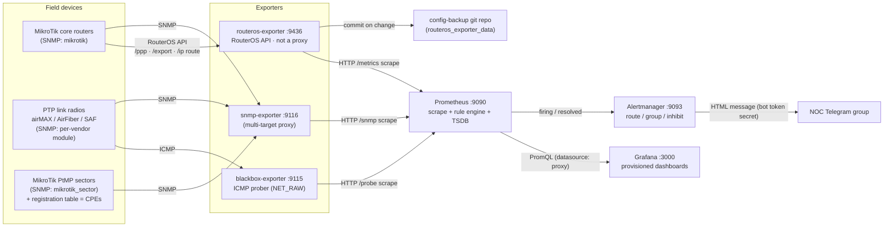
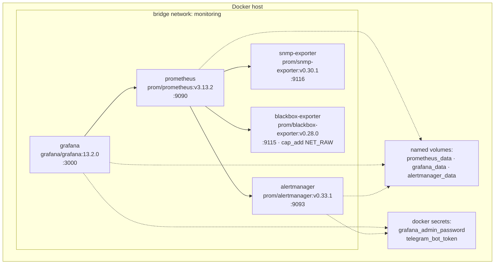
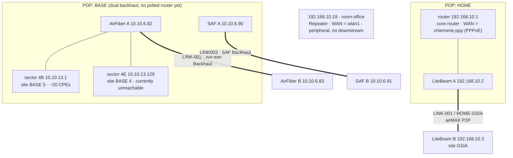
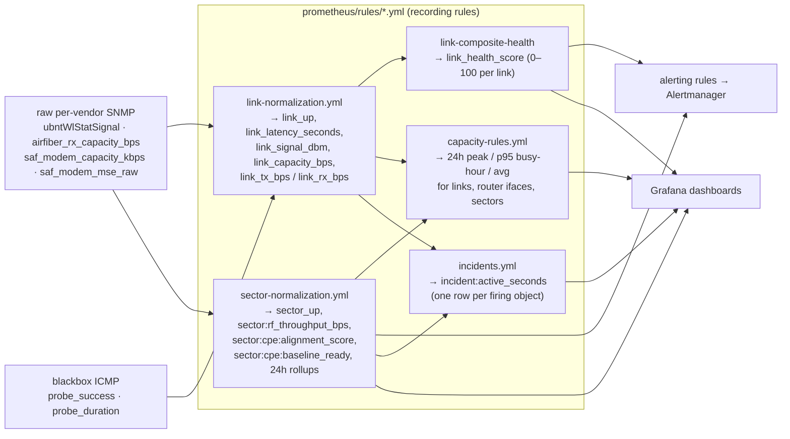
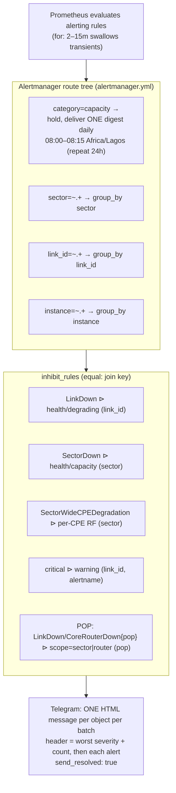

# Architecture

The ISP Network Observability Platform is a self-hosted monitoring stack for a
small wireless ISP: MikroTik core routers, licensed/unlicensed PTP backhaul
links (Ubiquiti airMAX, Ubiquiti AirFiber, SAF Integra) and MikroTik PtMP
sectors with their registered CPEs. It collects metrics over **SNMP** and
**ICMP**, evaluates recording/alerting rules in Prometheus, visualises them in
Grafana, and routes de-duplicated incidents to a NOC Telegram group through
Alertmanager.

Everything is configuration-as-code in this repo; nothing is edited only in a
UI.

---

## 1. Component / data-flow

**Proxy-scrape pattern.** Prometheus never speaks SNMP or ICMP itself. For every
SNMP/ICMP job the target device address is moved into `__param_target` and
`__address__` is rewritten to the exporter container, so the exporter receives
`GET /snmp?target=<device>&module=<name>` (or `/probe?...&module=icmp`) and does
the real work. This is the standard Prometheus *multi-target exporter* pattern.

---

## 2. Containers & network

All services run on a single Docker bridge network (`monitoring`) and reach each
other by container name. Only the ports below are published to the host.

| Service | Image | Host port | Config (read-only mounts) | State |
|---|---|---|---|---|
| prometheus | `prom/prometheus:v3.13.2` | 9090 | `prometheus/prometheus.yml`, `prometheus/rules/`, `prometheus/targets/` | `prometheus_data` (TSDB) |
| snmp-exporter | `prom/snmp-exporter:v0.30.1` | 9116 | `snmp_exporter/snmp.yml` | — |
| blackbox-exporter | `prom/blackbox-exporter:v0.28.0` | 9115 | `blackbox/blackbox.yml` | — |
| routeros-exporter | built from `routeros_exporter/` (`v0.1`) | 9436 | `routeros_exporter/config.yml` | `routeros_exporter_data` (config-backup git repo) |
| grafana | `grafana/grafana:13.2.0` | 3000 | `grafana/provisioning/`, `grafana/dashboards/` | `grafana_data` |
| alertmanager | `prom/alertmanager:v0.33.1` | 9093 | `alertmanager/alertmanager.yml` | `alertmanager_data` |

Secrets are mounted as files under `/run/secrets/<name>` (never env vars):
`grafana_admin_password`, `telegram_bot_token`, and `routeros_api_credentials`
(a JSON map of router name → `{username, password}` for the read-only RouterOS
API user). All source files live in `secrets/` and are gitignored.

Unlike the SNMP/ICMP exporters, **routeros-exporter is not a proxy target** — it
walks the routers itself over the RouterOS API and exposes `routeros_*` metrics
directly (job `routeros-api`, a plain `static_configs` scrape). It covers what
SNMP cannot: per-subscriber PPP/PPPoE sessions, config backup + drift, topology
auto-discovery. See
[tier1-subscriber-config-topology.md](tier1-subscriber-config-topology.md).

---

## 3. Network topology (monitored estate)

Hand-maintained in [`prometheus/topology.yml`](../prometheus/topology.yml). Not
loaded by Prometheus — it is the source of truth for the `pop` label you attach
to targets, which drives dependency-aware alert inhibition.

**Dependency rule:** if a POP's upstream backhaul link (or its router) is down,
every sector/router behind that POP is unreachable — so those downstream alerts
are *inhibited* rather than sent as separate incidents (see §5).

---

## 4. Metric pipeline — raw SNMP → vendor-agnostic series

Different radio vendors expose the same physical quantity under different OIDs
and different raw units. Normalisation happens centrally in recording rules so
dashboards and alerts never branch on vendor.

Schema reference: [`prometheus/rules/link-schema-notes.md`](../prometheus/rules/link-schema-notes.md)
(the canonical `link_*` schema, per-vendor source OIDs, and what is confirmed
working vs. deferred against live hardware).

Rule groups, by file:

| File | Groups | Purpose |
|---|---|---|
| `link-normalization.yml` | `link-availability`, `link-interface-health`, `link-derived-metrics` | raw SNMP/ICMP → `link_*` |
| `link-alerts.yml` | `link-state`, `link-health`, `link-degrading`, `link-composite-health` | LinkDown, WeakSignal, PacketLoss, LinkUpButDegrading, `link_health_score` |
| `mikrotik-alerts.yml` | `mikrotik-core` | CoreRouterDown, HighCPU, HighMemory, WANInterfaceDown |
| `ppp-sessions.yml` | `ppp-sessions` | SNMP-derived PPPoE session tracking (fallback path) |
| `subscriber-sessions.yml` | `subscriber-sessions` | RouterOS-API `subscriber:*` series (active by pop/router/sector, provisioned-offline, reconnects) |
| `subscriber-alerts.yml` | `subscriber-mass-outage`, `subscriber-stability`, `subscriber-housekeeping` | SubscriberMassOutagePOP/Router, PPPoEAuthFailureSpike, SubscriberChronicFlapping, ProvisionedButOffline |
| `config-backup.yml` | `config-backup` | RouterConfigChanged, RouterBackupStale/Failing, RouterOSVersionDrift |
| `topology-rollup.yml` | `topology-rollup`, `topology-alerts` | `topology:pop:isolated`, POPIsolated (root-cause rollup) |
| `sector-normalization.yml` | `sector-availability`, `sector-aggregates`, `sector-cpe`, `sector-cpe-derived`, `sector-24h`, `sector-hourly`, `sector-hour-of-day` | `sector_*` / `sector:*` derived series |
| `sector-thresholds.yml` | `sector-capacity-thresholds` | per-sector client/Mbps limits (default 15/20 clients, 20/25 Mbps) |
| `sector-alerts.yml` | `sector-availability`, `sector-performance`, `sector-device`, `sector-cpe`, `sector-capacity` | SectorDown, SectorWideCPEDegradation, CPE\* alerts, capacity digest |
| `capacity-rules.yml` | `capacity-links`, `capacity-routers` | busy-hour capacity-planning series |
| `incidents.yml` | `incidents` | NOC "Active Incidents" feed |

---

## 5. Alert pipeline — detect → route → inhibit → notify

Every alert carries four routing labels: `severity` (critical/warning/info),
`category` (state/health/capacity/degrading), `scope` (link/router/sector/cpe)
and `alert_type` (kebab-case symptom).

Anti-storm machinery (proven in [`docs/failure-drills.md`](failure-drills.md)
and `prometheus/rules/tests/alerts_test.yml`):

- **`for:`** 2–15 min — transients never notify.
- **`keep_firing_for:`** 5–10 min on state + flappy health alerts — a
  recover/re-break is one continuous alert, not a resolve/refire pair.
- **`group_by` + `group_interval: 10m`** — every alert about one object lands in
  one message.
- **`inhibit_rules`** — a parent incident (LinkDown, SectorDown,
  SectorEther1Down, SectorWideCPEDegradation, POP backhaul/router down) silences
  its symptoms; two-tier warning+critical pairs collapse to the critical.
- **Capacity digest** — `SectorOverClientCapacity` / `SectorOverThroughputBudget`
  never page; they batch into the 08:00 Africa/Lagos message.
- **`repeat_interval`** 2 h critical / 12 h warning — reminds, doesn't nag.

---

## 6. Dashboards

Auto-provisioned from `grafana/dashboards/` into the *ISP Monitoring* folder
(`grafana/provisioning/dashboards/dashboard.yml`, reloaded every 30 s).
Datasource is a single proxied Prometheus (`grafana/provisioning/datasources/`).

| Dashboard | JSON | Role |
|---|---|---|
| NOC Overview | `noc-overview.json` | front door — Active Incidents table + link/router/sector state counts + per-object health tables |
| PTP Link Monitoring | `ptp-link-monitoring.json` | one link: status, latency, loss, RF signal/noise/quality, capacity, vendor diagnostics |
| MikroTik Router Overview | `mikrotik-fleet-overview.json` | reachability, CPU, memory, storage, interface traffic/state |
| Sector Fleet Overview | `sector-fleet-overview.json` | one row per sector: clients/throughput vs capacity, noise, worst-CPE signal, misaligned/flapping counts, CPU |
| Sector Detail | `sector-detail.json` | one sector: stats, timeseries, per-CPE table (alignment score, worst-first), per-client signal/SNR, 24 h peak/budget |
| Capacity Planning | `capacity-planning.json` | 24 h peak / p95 busy-hour / avg for every link, router interface and sector |
| WAN/LAN Interfaces | `lan-wan-interfaces.json`, `all-interfaces.json` | traffic + up/down grouped by interface role (WAN/LAN/PPP/wireless backhaul) |
| Subscriber Overview | `subscriber-overview.json` | active vs provisioned sessions, active-by-POP timeline (mass-outage cliff), top flappers, disconnect reasons, auth failures |
| Config Audit | `config-audit.json` | last-backup age per router, config-change spikes, RouterOS versions across the fleet |

Alerting is **Prometheus + Alertmanager only** — Grafana's own alerting engine
is unused (`grafana/provisioning/alerting/.gitkeep`).

---

## 7. Adding things

| To add… | Edit | Notes |
|---|---|---|
| a core router | `prometheus/targets/mikrotik-routers.yml` | set `wan_ifname`; a second router with a different WAN ifName needs its own `WANInterfaceDown` rule (PromQL can't join ifName to a per-instance label) |
| a PTP link | `prometheus/targets/links.yml` | two endpoints sharing one `link_id`; set `module`, `auth`, `vendor`; add `pop:` if it's a POP backhaul |
| a PtMP sector | `prometheus/targets/mikrotik-sectors.yml` | one target per AP; CPEs ride the registration table; add `pop:`; override capacity in `sector-thresholds.yml` |
| an SNMP module / OID | `snmp_exporter/snmp.yml` | verify against a live `snmpwalk` before wiring an alert to it (see schema notes) |
| a router to the API collector | `routeros_exporter/config.yml` + `secrets/routeros_api_credentials.json` | set `pop`/`site` to match the SNMP targets; needs a read-only RouterOS API user; `docker compose restart routeros-exporter` |
| a dashboard | `grafana/dashboards/*.json` | picked up within 30 s, no restart |

Target files reload without a Prometheus restart (`refresh_interval: 1m`). Rule
and scrape-config changes need `docker compose restart prometheus` (or a
`SIGHUP` / `POST /-/reload`).
