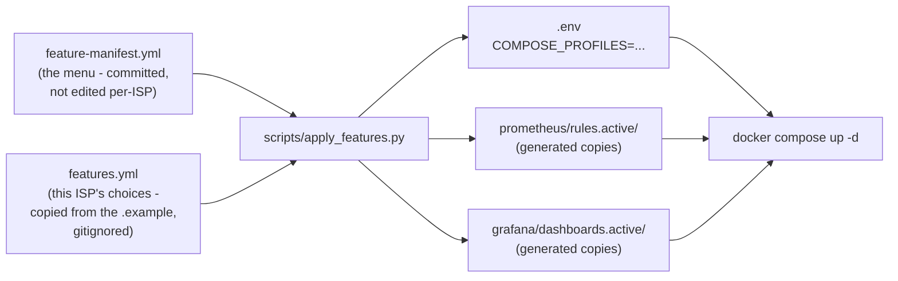

# Feature packaging — running only the features an ISP wants

Not every ISP deploying this stack wants everything: some want only the
SNMP/ICMP baseline (the "PRTG-equivalent"), some want PPP/subscriber
intelligence but not config backup, some want the full RouterOS API layer
plus anomaly detection. This is controlled by two files and one script -
no hand-editing `docker-compose.yml`, `prometheus.yml`, or the dashboard
folder per deployment.

## The three files



- **`feature-manifest.yml`** — the fixed menu: for each feature, which
  Prometheus rule files, which Grafana dashboards, and which Compose
  service profile it needs. You don't edit this when deploying to a new
  ISP; you edit it when the *product itself* changes (a new rule file gets
  added to a feature, a dashboard moves between features).
- **`features.yml`** (copied from `features.example.yml`, gitignored) —
  this deployment's actual choices: a flat `feature_name: true/false` list.
  This is the file an ISP-specific install edits.
- **`scripts/apply_features.py`** — reads both, and writes out what Compose
  actually consumes: an `.env` file (so `docker compose up -d` starts the
  right services with no `--profile` flags to remember) and two generated
  directories that stand in for the full rule/dashboard folders.

## The operational flow, end to end

1. **Pick your features.**
   ```bash
   cp features.example.yml features.yml
   $EDITOR features.yml
   ```
   Toggle `ppp_intelligence`, `config_backup`, `topology_discovery`,
   `anomaly_detection`. `base_monitoring` (SNMP + ICMP + the always-on
   dashboards) isn't in this file at all - it can't be turned off, see
   `feature-manifest.yml`.

2. **Apply it.**
   ```bash
   routeros_exporter/.venv/bin/python scripts/apply_features.py
   ```
   This is the one command that turns your choices into deployable state.
   Every run is a clean rebuild - safe to re-run any time you change
   `features.yml`, and it prints a summary of what it did:
   ```
   Enabled features:  base_monitoring, config_backup, ppp_intelligence, topology_discovery
   Disabled features: anomaly_detection
   Compose profiles:  routeros-api
   13 rule file(s) copied into prometheus/rules.active/
   10 dashboard(s) copied into grafana/dashboards.active/
   Now run: docker compose up -d
   ```

3. **Bring the stack up.**
   ```bash
   docker compose up -d
   ```
   No `--profile` flags needed - Compose reads `COMPOSE_PROFILES` straight
   out of the `.env` file the script just wrote. If no RouterOS-API feature
   is enabled, `routeros-exporter` is never built or started at all; if any
   of `ppp_intelligence` / `config_backup` / `topology_discovery` is on,
   it starts once and quietly does whichever of those three jobs are
   enabled per-router (see "Two layers of control" below).

That's the whole flow: **edit → apply → up**. Changing your mind later is
the same three steps again - edit `features.yml`, re-run the script,
`docker compose up -d` (Compose will stop/start containers as needed to
match the new profile set; for a rule/dashboard-only change, restarting
just `prometheus`/`grafana` is enough: `docker compose restart prometheus
grafana`).

## Two layers of control - don't confuse them

- **`features.yml`** (this doc) - a *product* decision: does this
  deployment offer PPP intelligence at all? Controls which containers run
  and which rules/dashboards exist.
- **`routeros_exporter/config.yml`**'s per-router `collect_ppp` /
  `collect_backup` / `collect_topology` flags (already existed before this)
  - an *operational* dial once a feature is switched on: "this particular
    repeater has no PPPoE server, don't bother polling `/ppp/active` on
    it." These stay exactly as they were; `features.yml` sits one level
    above them.

## Why `ppp_intelligence` / `config_backup` / `topology_discovery` can't be
## split into three separate containers

They share one thing: a single RouterOS API connection per router (see
`routeros_exporter/routeros_exporter/__main__.py`'s poll loop and the
live-tested connection-timeout/backoff logic in
`docs/tier1-subscriber-config-topology.md`). Splitting them into three
containers would mean three separate API connections hitting the same
router every poll cycle - exactly the kind of load that overwhelmed the
test hAP AC Lite earlier in this project. So all three share
`compose_profiles: [routeros-api]` in the manifest: enabling any one of
them starts the same one container, and the *rule/dashboard* files are
still cleanly separated per feature even though the *container* is shared.

## What's NOT covered by this system

- **`freq_migration`** (the sector frequency-migration CLI) isn't a
  running service - it's an operator-invoked tool with its own separate
  inventory/credentials file. There's nothing to enable or disable in
  `features.yml` for it; not installing its config files is enough to
  never touch it.
- **Per-router opt-outs** stay in `routeros_exporter/config.yml`, as above.

## If an ISP should never even have certain code on their box

Everything above is a *runtime* on/off switch - the code for a disabled
feature is still in the image, just never invoked. If a customer's
requirement is stronger than that (e.g. "don't ship me anything with
write access to CPEs, at all, for support-surface reasons"), that's a
different, heavier decision - physically separating that feature into its
own package/image - considered and deliberately deferred; see the
"Separating features" discussion this doc grew out of. `freq_migration` is
the one component already closest to that state (its own credentials, its
own inventory, nothing else imports it) if that's ever needed.
