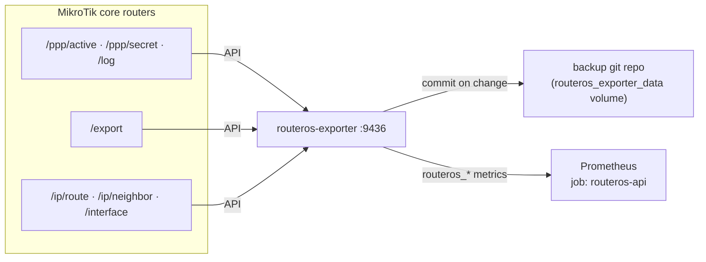

# Tier 1 — subscriber intelligence, config backup, topology auto-discovery

This is the first layer that takes the platform past a generic SNMP poller
(the "why not just run PRTG" question). It adds one component,
[`routeros_exporter/`](../routeros_exporter/), a RouterOS **API** collector,
and the Prometheus/Grafana/Alertmanager wiring around it.

Everything here is built against captured fixtures and unit-tested; items
that could only be confirmed on live hardware are marked
`UNVERIFIED - needs live device` in the code and listed in
[`routeros_exporter/README.md`](../routeros_exporter/README.md).

## Why the API and not more SNMP

`prometheus/rules/ppp-sessions.yml` and `prometheus/topology.yml` already
spell it out: RouterOS SNMP has no `/ppp active`, no PPPoE caller-id, no
disconnect reason, and no config export; the topology file is hand-kept and
its POP inhibit rules were inert. The API gives all of it.



## 1. Subscriber intelligence

| Metric | From | Use |
|---|---|---|
| `routeros_ppp_active_total{router}` | `/ppp/active` | mass-outage detection |
| `routeros_ppp_active_uptime_seconds`, `routeros_ppp_active_caller_id_info` | `/ppp/active` | per-session table, sector mapping |
| `routeros_ppp_secret_total{router}`, `routeros_ppp_secret{...}` | `/ppp/secret` | provisioned-vs-online |
| `routeros_ppp_disconnect_total{router,user,reason}` | `/log` | "why are sessions dropping" |
| `routeros_ppp_auth_failure_total{router}` | `/log` | wrong password / account sharing |
| `routeros_ppp_connect_total{router,user}` | `/log` | reconnect / flap counting |

Recording rules: `prometheus/rules/subscriber-sessions.yml`
(`subscriber:active:by_pop`, `:by_router`, `:by_sector`,
`subscriber:provisioned_offline:by_router`, `subscriber:reconnects:24h`, …).

Alerts: `prometheus/rules/subscriber-alerts.yml`

| Alert | Fires | Severity |
|---|---|---|
| `SubscriberMassOutagePOP` / `…Router` | ≥30% (and ≥3) of a POP's / router's sessions drop in ~5 min | critical |
| `PPPoEAuthFailureSpike` | >10 auth failures / 15 min on a router | warning |
| `SubscriberChronicFlapping` | one account ≥6 reconnects/24h, sustained 2h | warning |
| `RouterOSAPICollectorDown` | the API poll of a router fails 10 min | warning |
| `ProvisionedButOffline` | ≥5 enabled secrets offline 1h+ | warning (08:00 digest) |
| `SubscriberConnectedNoTraffic` | session up 24h+ at <2 kbps (SNMP `ppp:session:*`) | warning (08:00 digest) |

**Sector attribution is best-effort.** `UNVERIFIED`: the pppoe caller-id is
whatever MAC the POP sees as the frame source, which under station-bridge is
the client router's MAC, *not* the radio's registration MAC in the sector
table. The `caller_id ↔ cpe_mac` join in `subscriber-sessions.yml` only
resolves where those match. Router- and POP-level rollups (what mass-outage
detection uses) don't depend on it.

## 2. Config backup + drift

The exporter pulls `/export` from every router each cycle, strips the
volatile timestamp header, and commits it to a git repo on the
`routeros_exporter_data` volume when it changed. Restore:
`git -C <repo> show <rev>:<router>.rsc`.

Metrics: `routeros_config_changed`, `routeros_config_last_backup_timestamp`,
`routeros_config_last_change_timestamp`, `routeros_config_export_lines`,
`routeros_config_backup_success`.

Alerts (`prometheus/rules/config-backup.yml`): `RouterConfigChanged`
(warning, on every diff), `RouterBackupStale` (critical, >25h),
`RouterBackupFailing` (warning), `RouterOSVersionDrift` (info).

> **Resolved 2026-09-14** (was a known gap as of 2026-09-12): with a
> read-only API user, `/export` never succeeded on this RouterOS 6.x fleet
> - a bare `/export` hangs instead of returning, and the only variant that
> replies (`/export file=<name>`) needs `write` to create the file, which
> RouterOS 6.x's API then can't read back anyway (only FTP can). Fixed by
> widening the monitoring credential to a custom group scoped to exactly
> `api, read, write, ftp` and fetching the export over FTP -
> `export_via_api` now does `/export file=...` then an FTP RETR + delete.
> Getting there took chasing what looked like a hardware ceiling on the
> test router (a hAP AC Lite): `/export file=...` kept hanging even with
> `write` granted, right up until CONFIRMED 2026-09-14 that `client.connect`
> had a real bug (it ignored the configured timeout entirely, always using
> librouteros's 10s default) - the export genuinely just takes ~52s on this
> device, and FTP needed to actually be enabled too. With both fixed,
> confirmed working end-to-end: a real 110-line export committed to git.
> **The backup content itself turned out to be sensitive** - RouterOS 6.x's
> `/export` does not mask passwords by default (a live export had a WiFi
> PSK in plain text); treat the backup repo like `secrets/`. Also confirmed
> live: retrying a failed attempt every cycle was aggressive enough to
> break the router's routine polling too, so a backoff was added
> (`__main__.py`'s `BACKOFF_AFTER_FAILURES`) - after 2 misses it settles to
> one gentle attempt an hour. PPP/system/topology collection was never
> affected either way (isolated per-collector in `__main__.poll_router`).
> Details + the RouterOS commands to run: `routeros_exporter/README.md`.

Dashboard: **Config Audit** (`grafana/dashboards/config-audit.json`).

## 3. Topology auto-discovery + dependency-aware alerting

`routeros_exporter/topology.py` derives the POP → backhaul → router →
sector tree from `/ip/route` (default gateway = upstream), `/ip/neighbor`
(MNDP/LLDP), `/interface`. It emits `routeros_topology_edge{router,peer,type}`
and writes `topology.generated.yml` next to the hand file (which stays
authoritative for the `pop` label).

`prometheus/rules/topology-rollup.yml`:

- `topology:pop:isolated` — 1 when **every** backhaul `link_up` series for a
  POP is 0.
- `POPIsolated` (critical) — the single root-cause incident. Its
  Alertmanager inhibit rule (`equal: [pop]`) silences every downstream
  sector / link / subscriber alert for that POP, so a backhaul outage is
  **one** Telegram message naming the subscriber impact, not a storm.

This is what finally activates the POP-dependency machinery that
`prometheus/topology.yml` and `alertmanager/alertmanager.yml` were built
for — it needed `pop` labels on the backhaul link targets (now in
`prometheus/targets/links.yml`) and on the API series (via
`routeros_router_info`).

## Deploy

```bash
cp routeros_exporter/config.example.yml routeros_exporter/config.yml     # edit router list
cp routeros_exporter/routeros_api_credentials.example.json \
   secrets/routeros_api_credentials.json                                  # read-only API user
docker compose up -d routeros-exporter
docker compose restart prometheus                                         # pick up new rules + scrape job
```

## Out of scope (later tiers)

Automated remediation / self-healing (Tier 3, still fully out of scope),
the anomaly-detection + LLM incident-summary layer (Tier 2), billing-system
provisioning integration.

**Sector frequency migration started 2026-09-16** as a scoped-down,
human-gated exception to "later tier": `routeros_exporter`'s `freq_migration`
CLI (see its README section) scans a sector's RF environment, prepares
every connected CPE with a short migration scan-list, then changes the
sector frequency and reports who reconnected - with an explicit approval
gate before each of those three steps, never automatic. This is
deliberately not the fuller "controller verifies CPE identity post-move,
retries CPE-by-CPE" design considered first; that's still available to
revisit if the simpler version proves insufficient in practice.
